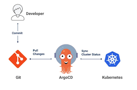

# 🧠 What is GitOps?

GitOps is a **modern DevOps practice** that uses **Git as the single source of truth** for managing both **application deployments** and **infrastructure changes**. Just like how DevOps uses tools like Docker, Kubernetes, and Jenkins to automate development workflows, **GitOps uses tools like Argo CD and Flux** to automate Kubernetes deployments using Git.

### 🤔 So, what does GitOps actually mean?

Think of GitOps like this:

* You **declare** your infrastructure and application state in YAML files (for example, Kubernetes manifests).
* You **store** those files in a Git repository (like GitHub).
* A **GitOps tool (e.g., Argo CD)** continuously monitors the Git repo.
* If any changes are made to Git, **only those changes** are automatically deployed to your Kubernetes cluster.
* **Manual changes in the cluster are reverted**. Git is the source of truth.

> 💡 **"If it’s not in Git, it doesn’t happen."** That’s the GitOps principle.

---

# 🚀 Argo CD: The GitOps Tool

**Argo CD** (short for Argo Continuous Delivery) is one of the most popular GitOps tools. It works like a **controller** that continuously watches your Git repository and Kubernetes cluster.

* When it detects changes in Git, it **automatically syncs** the Kubernetes cluster to match the Git state.
* If someone tries to manually change something directly on the Kubernetes cluster, **Argo CD will detect it** and automatically roll it back to match the state defined in Git.

---

# 🧱 GitOps Principles (Core Concepts)

GitOps is based on 4 key principles:

1. **Declarative**:

   * You declare the desired state in files (e.g., YAML).
   * "What you see in Git is what you want deployed."

2. **Versioned and Immutable**:

   * Git tracks every change.
   * Every update is version-controlled.
   * Rollbacks are easy by reverting to previous commits.

3. **Pulled Automatically**:

   * GitOps tools **pull** changes automatically from the repo.
   * No manual push needed to deploy.

4. **Continuously Reconciled**:

   * Tools like Argo CD **monitor and correct drift** between the live cluster and Git.
   * If someone changes the cluster manually, the GitOps tool corrects it back.

---

# ❓ Is GitOps Only for Kubernetes?

Not necessarily. GitOps is a **concept**, and in theory, it can be used with other platforms.
But **current GitOps tools like Argo CD and Flux are specifically designed for Kubernetes**.

---

# ✅ Benefits of GitOps

* **Security**: All changes go through Git, enabling code reviews and approvals.
* **Version Control**: Easy to track, audit, and roll back changes.
* **Automation**: No manual intervention needed for deployments.
* **Consistency**: The cluster always matches what's in Git.
* **Self-healing**: If the actual state drifts, the system auto-fixes it.
* **Developer-friendly**: Developers can make changes just by updating YAML in Git.

---

# 🏗️ Argo CD Architecture Explained

Let’s look at the **main components** of Argo CD and what they do:

Refer: https://argo-cd.readthedocs.io/en/stable/developer-guide/architecture/components/#dependencies

| Component                  | Role                                                                                                  |
| -------------------------- | ----------------------------------------------------------------------------------------------------- |
| **API Server**             | Handles UI and CLI requests. This is the entry point for users.                                       |
| **Repo Server**            | Watches the Git repository. Fetches and stores the manifests (YAML files).                            |
| **Application Controller** | Continuously compares desired (Git) and actual (K8s) states. Syncs them if there's a drift.           |
| **Dex**                    | Handles authentication (can use Google, GitHub, etc.).                                                |
| **Redis**                  | Used for caching internal data to improve performance.                                                |
| **Git Repository**         | This is where all your application manifests (YAML files) are stored. Git is the **source of truth**. |
| **Kubernetes Cluster**     | The place where the applications are actually deployed and running. 

### 🔁 How It Works (Step-by-Step)

1. You **push a new YAML manifest** or change into the GitHub repo.
2. Argo CD's **Repo Server detects the change**.
3. The **Application Controller** checks the difference between Git and the Kubernetes cluster.
4. If there is a change, it **syncs the Kubernetes cluster to match Git**.
5. If someone makes a manual change on the cluster, Argo CD detects it and **restores it back** based on Git.

