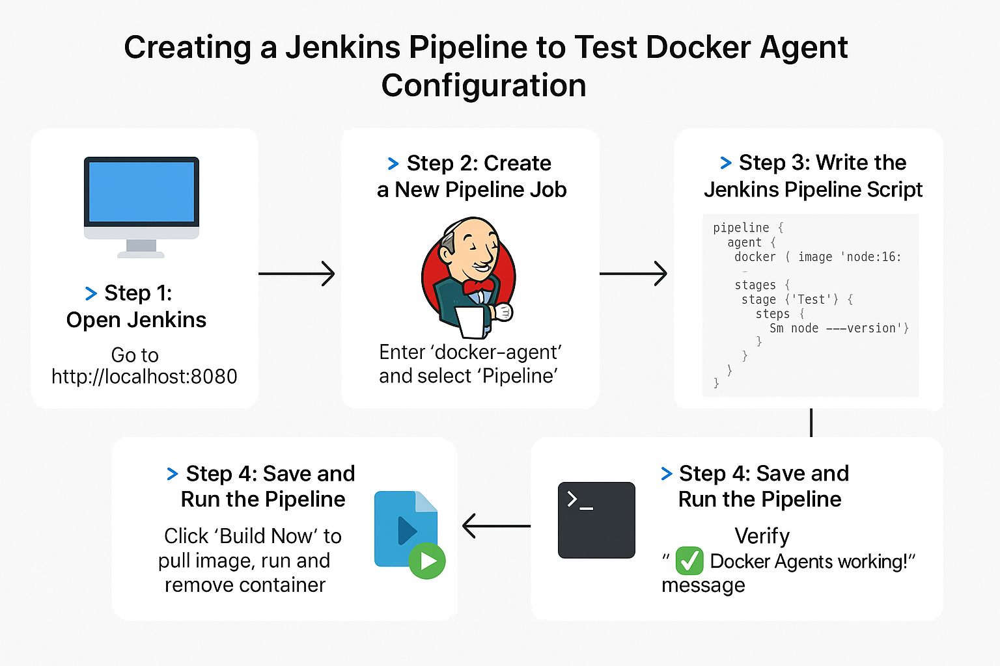

---

## 🧪 **Project Title:**

## **Creating a Jenkins Pipeline to Test Docker Agent Configuration**


---

## ✅ **What Is This Project About?**
In this project, we will create a **Jenkins Pipeline Job** to check if **Docker Agent** is working properly.

* A Docker Agent means: instead of running builds directly on the Jenkins server (host machine), Jenkins will **spin up a Docker container** to run your job safely inside it.
* Once the job completes, Jenkins will **remove the container**—clean and efficient!

---

## 🎯 **Why Do This Project? (What You’ll Learn)**

| Topic            | Skill You Learn                               |
| ---------------- | --------------------------------------------- |
| Jenkins UI       | Creating a pipeline job                       |
| Pipeline as Code | Writing simple Jenkinsfile                    |
| Docker Agent     | How Jenkins uses Docker containers for builds |
| Troubleshooting  | How to verify Docker + Jenkins integration    |
| SCM Integration  | Pull code from GitHub/Git                     |

---

## 🧩 **Why Use Pipeline Instead of Freestyle?**

| Freestyle Job | Pipeline Job                            |
| ------------- | --------------------------------------- |
| Manual steps  | Scripted & automated                    |
| Not reusable  | Code can be shared (Jenkinsfile)        |
| UI dependent  | Version-controlled                      |
| Less flexible | More powerful (loops, conditions, etc.) |

---
## 🧰 **Pre-requisites**  
refer commonsteps.md file for these steps

* Jenkins installed (with Docker plugin configured)
* Docker installed and running on the same system as Jenkins
* Jenkins user added to Docker group (for permissions)

---

## 🚀 **Step-by-Step Instructions**

---

### 🔹 Step 1: Open Jenkins

Go to your browser and open Jenkins:

```
http://Ipaddress:8080
```

---

### 🔹 Step 2: Create a New Pipeline Job

1. Click **“New Item”**
2. Enter a **name** like `docker-agent-test`
3. Choose **“Pipeline”**
4. Click **OK**

---

### 🔹 Step 3: Write the Jenkins Pipeline Script

### ✅ Option 1: Paste Script Directly

* Go to **Pipeline** section
* Set **Definition** = `Pipeline script`
* Paste your pipeline code in the **Script** box

### ✅ Option 2: Import from SCM (e.g., GitHub)

* Set **Definition** = `Pipeline script from SCM`
* Choose **SCM** = `Git`
* Enter:

  * **Repo URL**
  * **Branch name** (e.g., `main`)
  * **Script Path** (e.g., `Jenkinsfile`)

---

```groovy
pipeline {
  agent {
    docker { image 'node:16-alpine' }
  }
  stages {
    stage('Test') {
      steps {
        sh 'node --version'
      }
    }
  }
}
```

---

### 🔹 Step 4: Save and Run the Pipeline

1. Click **Save**
2. Click **Build Now**
3. You’ll see the job starting – Jenkins will:

   * Pull the **alpine** Docker image
   * Run the job **inside a container**
   * After completion, the **container will be destroyed**

---

### 🔍 Step 5: Check Console Output

* Click on the build number (like `#1`)
* Click **Console Output**
* You should see:

  ```
  ✅ Docker Agent is working!
  ```

  and OS info from inside the container.

---
